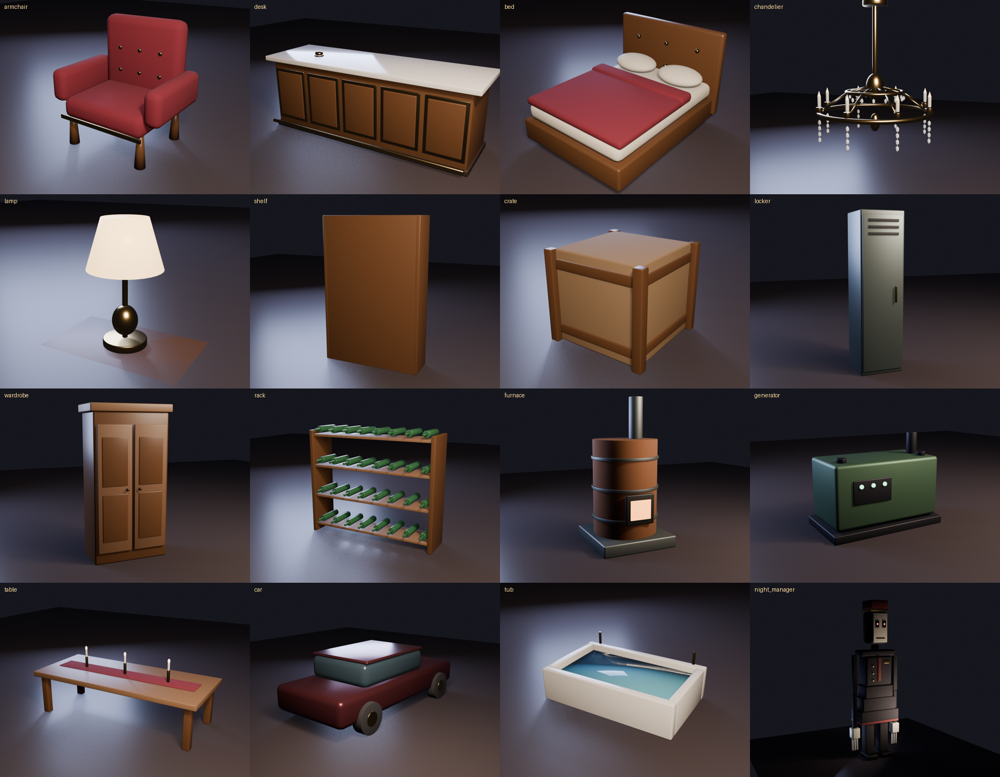

# Art pipeline: Blender models in the game

The hotel works without any imported art: every prop has a part-built version (`src/server/Props.luau`). The Blender models are the better-looking replacements, and the game uses them automatically as soon as they exist in your place.

## What is in the repo

- `art/blender/props.py`: builds each prop (bevels, real materials, lighting), renders `art/renders/<kind>.png`, exports `art/models/<kind>.glb` **and** `.fbx`, plus `<kind>.styles.json` (colour and material of every part).
- `scripts/build-styles.luau` turns the style files into `src/shared/Game/ModelStyles.luau`, which the game uses to paint imported parts (Roblox's importer ignores flat Blender colours).
- 14 props are ready: armchair, desk, bed, lamp, shelf, crate, locker, wardrobe, rack, furnace, generator, table, car, tub. (The chandelier, pool and flooded water stay part-built.)

## Import steps (once, in Studio on the PC)

1. `git pull`, then open the place with Rojo connected.
2. **View > Asset Manager > Bulk Import**, pick the `.fbx` files from `art/models/` (all 14), import.
3. In **ReplicatedStorage** create a **Folder named `Models`**. Move each imported model in and name it exactly as the file: `armchair`, `desk`, `bed`, `lamp`, `shelf`, `crate`, `locker`, `wardrobe`, `rack`, `furnace`, `generator`, `table`, `car`, `tub`.
4. Save the place (Rojo does not touch the `Models` folder) and press Play.

The game clones each model, scales it to the footprint in `Furnishing.luau`, stands it on the floor facing the room, paints each part from `ModelStyles`, and adds the invisible `Body` (hiding) and `Bell` (desk) parts the systems look for.

**If one faces the wrong way:** select its model in `Models`, add a number attribute named `Yaw` and set it to 90, 180 or 270 (add 90 or 270 if its long side ends up across the footprint). **If it is the wrong size:** it cannot be: the size is fitted automatically to the footprint.

## Remaining art work

- The Night Manager is still a client-side part rig (`src/shared/NightManagerRig.luau`). A skinned Blender character with real walk/chase animations needs a rigged FBX: planned, see ROADMAP.
- The car is a toy-grade background prop; the chandelier could be a mesh.
- Textures (wood grain, wallpaper) would lift the look further than flat colours: a bake step in Blender is the next improvement.

## Re-making a model

    scripts/blender.sh art/blender/props.py -- armchair      # edit the function in props.py first
    lune run scripts/export-layout                           # (only when changing the hotel layout)
    lune run scripts/build-styles && stylua src              # refresh ModelStyles.luau after changing colours

Blender 4.5 runs headless from `~/tools` (see `art/README.md`).
